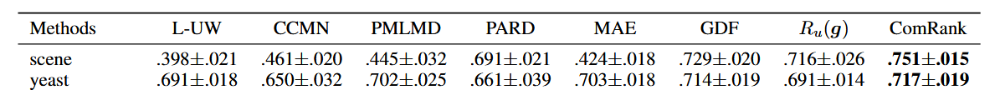

# A Reproduction of ComRank

This repository presents a reproduction study of *[ComRank: Ranking Loss for Multi-Label Complementary Label Learning](https://openreview.net/forum?id=uVjuiPP4aP)*, built upon the [official implementation](https://github.com/JellyJamZhu/ComRank).

## Contents

- [1. Overview](#1-overview)
- [2. Background](#2-background)
  - [2.1 Multi-Label Learning](#21-multi-label-learning)
  - [2.2 Complementary Label Learning](#22-complementary-label-learning)
  - [2.3 Ranking Loss](#23-ranking-loss)
- [3. Theory](#3-theory)
  - [3.1 Limitations of URE-based Methods](#31-limitations-of-ure-based-methods)
  - [3.2 Complementary Ranking Loss](#32-complementary-ranking-loss)
  - [3.3 Bayes Consistency](#33-bayes-consistency)
- [4. Experiments](#4-experiments)
  - [4.1 Experimental Setup](#41-experimental-setup)
  - [4.2 Implementation Details](#42-implementation-details)
  - [4.3 Results](#43-results)
- [5. Discussion](#5-discussion)
- [6. Conclusion](#6-conclusion)

## 1. Overview

This work reproduces **ComRank**, a method for Multi-Label Complementary Label Learning (MLCLL), where only incorrect (complementary) labels are available.

Unlike URE-based approaches that rely on distribution assumptions, ComRank formulates the problem as a ranking task by enforcing complementary labels to have lower scores than others.

We implement ComRank and several baselines (MAE, GDF, Ru(g)) in a unified framework and evaluate them on the *scene* and *yeast* datasets.

## 2. Background

### 2.1 Multi-Label Learning
**Each sample can belong to multiple classes simultaneously.**

A typical model consists of a backbone network followed by a fully connected layer, and a sigmoid function applied independently to each class. Each output represents the probability that the corresponding class exists.

The most commonly used loss function is Binary Cross Entropy (BCE):

$$L = - \sum_{k=1}^{K} \left[y_k \log p_k + (1 - y_k)\log(1 - p_k)\right]$$

where $p_k$ is the predicted probability for class $k$. BCE treats each class as an independent binary classification task.

Other choices include Mean Squared Error (MSE),

$$L = \frac{1}{K} \sum_{k=1}^{K} (p_k - y_k)^2$$

and Mean Absolute Error (MAE),

$$L = \frac{1}{K} \sum_{k=1}^{K} |p_k - y_k|$$

which measure the squared and absolute differences between predictions and labels, respectively, and treat the task as a regression problem. However, these losses model each class independently and do not capture relationships between labels.

### 2.2 Multi-Label Complementary Label Learning
**Instead of true labels, we only know which labels are incorrect.**

This indicates that we know the negative classes, while the true positive labels remain unknown. 

Standard supervised losses cannot be directly applied due to missing explicit positive labels. To address this, a line of work studies how to learn from complementary labels by reconstructing the classification risk.

A representative approach is the Unbiased Risk Estimator (URE), which reformulates the expected risk using only complementary supervision under certain assumptions

### 2.3 Ranking Loss
**Learn relative ordering between class scores instead of absolute labels.**

Given class scores $f(x, k)$, the model enforces:

$$f(x, i) > f(x, j)$$

where $i$ is a potentially relevant class and $j$ is an irrelevant (complementary) class.

A common formulation is the pairwise ranking loss:

$$L = \sum \max(0, 1 - (f_i - f_j))$$

These methods are widely used in learning-to-rank problems and have been adapted to weakly supervised settings.

## 3. Theory

### 3.1 Limitations of URE-based Methods

Existing URE-based methods rely heavily on the uniform assumption of complementary label generation, which fails in real-world scenarios due to instance-specific annotation biases. Moreover, URE-based methods do not explicitly exploit label correlations.

### 3.2 Complementary Ranking Loss

To address these issues, we reformulate MLCLL from a ranking perspective.

Given a sample \(x\), a complementary label \(\bar{y}\) is guaranteed to be irrelevant, while non-complementary labels may contain relevant ones. Therefore, it is reasonable to enforce:

$$f_k(x) > f_{\bar{y}}(x), \quad \forall k \neq \bar{y}$$

This leads to the complementary ranking loss:

$$\bar{L}(g(x), \bar{y}) = \sum_{k \neq \bar{y}} I(g_k(x) > g_{\bar{y}}(x))$$

To enable optimization, we introduce a surrogate loss:

$$\bar{L}_{CR}(g(x), \bar{y}) = \sum_{k \neq \bar{y}} \exp(g_{\bar{y}}(x) - g_k(x))$$

this framework is named **ComRank**.

### 3.3 Bayes Consistency

The theoretical property of ComRank can be analyzed from a decision-theoretic perspective.

Minimizing the complementary ranking loss induces the following ordering:

$$g_k(x) \ge g_j(x) \Leftrightarrow p(k = \bar{y} | x) \le p(j = \bar{y} | x)$$

This relationship holds under both uniform and biased complementary label distributions.

Since complementary labels are negatively correlated with true labels, labels with higher probability of being relevant tend to have lower probability of being selected as complementary labels. This implies an inverse relationship in terms of ordering:

$$
p(k = \bar{y} | x) \le p(j = \bar{y} | x) \;\Rightarrow\; p(k \in Y | x) \ge p(j \in Y | x)
$$

which leads to the Bayes optimal ordering:

$$
g_k(x) \ge g_j(x) \Leftrightarrow p(k \in Y | x) \ge p(j \in Y | x)
$$

Therefore, ComRank is Bayes consistent under both uniform and biased complementary label distributions.

## 4. Experiments

### 4.1 Experimental Setup

**Datasets**  
We conduct experiments on the preprocessed datasets provided in the official implementation, including *scene* and *yeast*.

From the code implementation, the dataset is loaded through the `ComFold` function in `dataset_new.py`. The training/test split is performed using index slicing under a 10-fold cross-validation setting.

```python
data = np.genfromtxt(Filename[0], delimiter=',')
label = np.genfromtxt(Filename[1], delimiter=',')
com_label = np.genfromtxt(Filename[2], delimiter=',')
```

**Complementary Label Settings**  
Two complementary label generation strategies are evaluated:
- **Uniform:** complementary labels are randomly sampled from irrelevant labels.
- **Biased:** complementary labels are sampled according to label co-occurrence statistics, introducing instance-dependent bias.

**Baselines**  
We compare the proposed method with the following groups of methods:  
- MLCLL methods: MAE, GDF, Ru(g)

### 4.2 Implementation Details

We directly adopt the official PyTorch implementation provided by the authors. All experiments are conducted using the released CSV-formatted datasets (*scene* and *yeast*).

The model is optimized using SGD, with learning rates selected according to dataset-specific settings. The complementary ranking loss is optimized in an end-to-end manner.

--

**Baseline Implementation Strategy**

All compared methods are implemented within the same training framework by switching the loss function in `utils_algo.py`. This ensures a fair comparison under identical model architecture, optimizer, and data splits.

Specifically, different methods correspond to different loss functions:
- ComRank: `rank_exp_consis`
- Ru(g): `unbiased_bce`
- GDF: `class_mae`
- MAE: `mae`

During training, the loss is selected via a command-line argument:

```python
if args.lo == "unbiased_bce":
    loss = unbiased_bce(outputs, com_labels)
elif args.lo == "mae":
    loss = mae(outputs, com_labels)
elif args.lo == "class_mae":
    loss = gdf(outputs, com_labels)
elif args.lo == "rank_exp_consis":
    loss = rank_exp_consis(outputs, com_labels)
```

This design ensures that all methods share:

- identical model architecture
- identical data splits
- identical optimization settings

and differ only in the learning objective.

--

From the implementation perspective, the complementary ranking loss is computed in `utils_algo.py`. Specifically, the model first applies a sigmoid function to obtain class-wise probabilities, then extracts the score of the complementary label using element-wise masking. Pairwise ranking constraints are enforced through exponential penalties between complementary and non-complementary classes.

```python
def rank_exp_consis(outputs, com_labels):#consis exp version
    # Apply sigmoid activation to convert logits to probabilities
    sig_outputs = torch.sigmoid(outputs)

    # Get scores for the complementary labels
    comp_scores = torch.sum(sig_outputs * com_labels, dim=1, keepdim=True)

    # Compute the differences exp(f_u(x_i) - f_y_bar(x_i)) for all u != y_bar
    differences = sig_outputs - comp_scores.expand_as(sig_outputs)

    # Compute the exponential terms
    exp_terms = torch.exp(-differences)

    # Mask out the complementary labels to exclude them from the sum
    non_com_labels = 1 - com_labels
    masked_exp_terms = exp_terms * non_com_labels

    # Compute the log-sum-exp over the non-complementary labels
    sample_loss =torch.sum(masked_exp_terms, dim=1)

    # Calculate the mean of the loss over the batch
    loss = torch.mean(sample_loss)

    return loss
```

To efficiently reproduce all experiments, the original `main.py` is slightly modified to support automatic execution over multiple datasets, methods, and cross-validation folds.

```python
if __name__ == '__main__':
    data = ["scene","scene_bia","yeast","yeast_bia"]
    lr_1e_1 = ["yeast","yeast_bia", "Corel16k15","rcv1_15","rcv1_15_bia"]
    lr_1e_2 = ["scene", "scene_bia", "bookmark15","bookmark15_bia"]
    methods = ["rank_exp_consis", "unbiased_bce", "class_mae", "mae"]
    theo = [0.5]
    for m in methods:
        for i in theo:
            for ds in data:
                for fd in [0]:
                    args = parser.parse_args()

                    if ds in lr_1e_1:
                        args.lr = 0.1
                    elif ds in lr_1e_2:
                        args.lr = 0.01
                    else:
                        args.lr = 0.001

                    args.dataset = ds
                    args.fold = fd
                    args.the = i
                    args.model = 'linear'

                    # 跑所有数据集
                    args.lo = m

                    print(args)
                    main()
```

### 4.3 Results

Owing to constraints in computational resources and time, I only conduct one fold for each and do the principal data analysis.You can find the data in `./my_result`. 

Table 1: Average Precision on the training data. The best performance of each dataset is shown in **boldface**.

|  Datasets  |   MAE   |     GDF     |  Ru(g)  |    ComRank    |
|:----------:|:-------:|:-----------:|:-------:|:-------------:|
|   scene    | 0.4158  |   0.7508    | 0.7294  |  **0.7791**   |
| scene_bia  | 0.4127  |   0.7081    | 0.6885  |  **0.7349**   |
|   yeast    | 0.7094  | **0.7156**  | 0.6701  |  **0.7119**   |
| yeast_bia  | 0.7141  | **0.7071**  | 0.6497  |  **0.7029**   |

The results of scene_bia and yeast_bia are generally consistent with Table 1 in the paper.



## 5. Discussion

1. **ComRank** achieves the best performance on *scene* under both uniform and biased settings, which is consistent with the original paper and demonstrates the effectiveness of ranking-based learning.

2. On *yeast*, **ComRank** does not show clear superiority over GDF. This is partly because only a single fold is conducted in this reproduction, which may introduce variance, and partly because the advantage of **ComRank** on this dataset is inherently less significant.

3. The performance (Average Precision) typically increases in early epochs and then decreases in later stages. This is mainly due to overfitting.

4. All methods are implemented under the same framework by only changing the loss function, ensuring fair comparison but possibly limiting the full potential of some baselines.

## 6. Conclusion

In this work, we reproduced ComRank within a unified PyTorch framework by formulating MLCLL as a ranking problem.

We implemented ComRank and baseline methods (MAE, GDF, Ru(g)) under identical settings by switching loss functions. Experiments on the *scene* and *yeast* datasets show that ComRank achieves competitive or better performance.

Although only a single fold is used, the observed trends are consistent with the original paper, partially validating the effectiveness of ranking-based learning in complementary label settings.

Overall, this reproduction demonstrates that ComRank is a simple yet effective approach, especially under biased complementary label distributions.